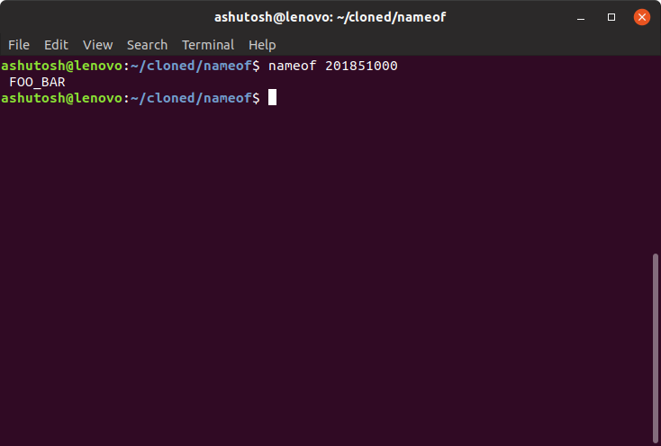

# nameof
A simple and handy tool to find the name of a student from command line using their Institute ID

## What can it do?

This is a command line tool whch can give you the name of any student from the batch of 2018-2022 by their institute ID.

## Why I built it?

Considering the strength of our batch and the fact that almost every academic activity involves our ID's, it sometimes becomes difficult to identify and find people by their ID's. Hence I've built this command line tool to find names from ID.

## How to use?

1.) Clone this repository using 

  `git clone https://github.com/ashutoshsingh05/nameof.git`

 2.) Change current directory to your local repository

  `cd nameof`

3.) Make install.sh executable and execute install.sh

  ```
  chmod 751 install.sh
  ./install.sh
  ```

4.) Run by executing the following command
 
  `nameof <insert-9-digit-institute-id>`
  
 **Try using sudo if you encounter any permission related issues**
 
  ## Screenshot
 
 
 
 
 ## Proposed Enhancements in future
 - Addition of more details like
    + Section
    + Lab Group
 - Enabling searching of student details using name
 - Making provisions for getting names of multiple students at a time by providing multiple space separated arguments.
